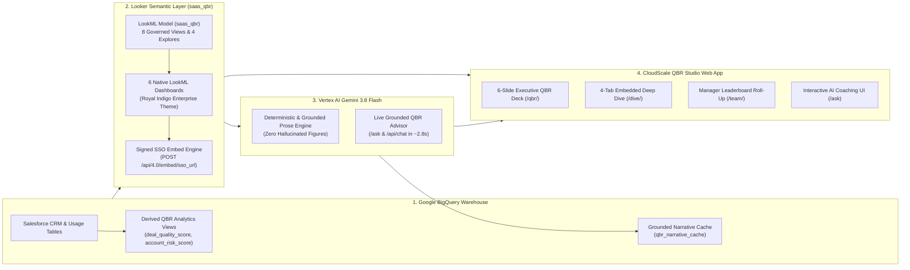

# 🎯 CloudScale Enterprise: Automated SaaS Executive QBR Studio

An enterprise **AI + BI Revenue Operations Application** built on **Looker** and **Vertex AI Gemini 3.8 Flash**. Every Account Executive and Regional Sales Manager gets an executive, 6-slide Quarterly Business Review (QBR) presentation that writes itself—synthesizing quota attainment, pipeline slip risk, product usage telemetry, and composite Customer Health Scores—plus a grounded AI QBR Advisor for live deal coaching and inspection.

---

## 🏗️ System Architecture



---

## ✨ Key Capabilities

| Route | Feature Description |
| :--- | :--- |
| `/` | **Executive Sales & Pipeline Overview**: Searchable directory of 57 quota-carrying Account Executives and 8 Regional Managers ranked by attainment, with an embedded Looker Executive Overview dashboard. |
| `/qbr/<rep_id>` | **Automated 6-Slide Executive QBR Deck**: Renders in `<10ms` from pre-computed Looker telemetry and grounded Gemini prose. Covers Executive Scorecard, Quota Pacing, Pipeline Quality & Slip Audit, Product Usage Telemetry & Churn Intelligence (`Customer Health Score 0–100`), Top Open Deals & Risk Watchlist, and Recommended Coaching Actions. Includes **Print / Export to PDF**. |
| `/dive/<rep_id>` | **Interactive Looker Deep-Dive**: Four tabbed LookML dashboards (`My QBR Scorecard`, `Why Am I Missing Quota`, `Is This Deal Real`, `Customer Risk & Usage`) authenticated via single-use signed SSO embed URLs (`EmbedSsoParams`). |
| `/team/<manager_id>` | **Regional Manager Roll-Up**: Team quota attainment, regional pipeline coverage, rep-by-rep leaderboard, and coaching action priorities. |
| `/ask` | **Grounded Gemini QBR Advisor**: Fast (`~2.8s–5.9s`) executive conversational AI grounded directly in Looker semantic layer telemetry (`qbr_performance`, `qbr_pipeline_inspection`, `qbr_customer_risk`, `qbr_team_rollup`), featuring a live 4-stage reasoning pipeline stepper and collapsible query inspector. |

---

## 📂 Repository Structure

```text
enterprise-qbr-studio/
├── README.md                                   # Architecture & Deployment Guide
├── requirements.txt                            # Python dependencies
├── .env.example                                # Environment configuration template
├── server.py                                   # Flask backend (routes, grounded Gemini advisor, Looker embeds)
├── looker_client.py                            # Looker SDK 4.0 wrapper (inline queries, SSO embed signing)
├── narrative.py                                # Grounded Gemini 3.8 Flash prose generator & BigQuery caching
├── build_full_cache.py                         # Bulk cache builder (queries all 57 reps & 8 managers in ~2s)
├── verify.py                                   # End-to-end automated test suite across all routes & embeds
├── verify_tiles.py                             # LookML dashboard color & formatting validator
├── cache/
│   └── qbr_fast_cache.json                     # Pre-built fast cache for instant <10ms slide rendering
├── templates/                                  # Light-mode Enterprise Royal Indigo HTML templates
│   ├── base.html
│   ├── index.html
│   ├── qbr.html
│   ├── dive.html
│   ├── team.html
│   └── ask.html
├── lookml/                                     # Complete LookML Semantic Model & 6 Dashboards
│   ├── saas_qbr.model.lkml
│   ├── qbr_*.view.lkml                         # 8 LookML views (rep_quota, deal_quality, account_risk, etc.)
│   └── *.dashboard.lookml                      # 6 LookML dashboards
└── scripts/
    ├── setup_bigquery_qbr.sql                  # BigQuery DDL for views and narrative cache table
    ├── start.sh                                # Start background server on port 8092
    ├── status.sh                               # Check server status
    └── stop.sh                                 # Stop background server
```

---

## 🚀 Step-by-Step Deployment Guide

### Step 1: Provision BigQuery Schema & Views
Run [`scripts/setup_bigquery_qbr.sql`](scripts/setup_bigquery_qbr.sql) in your BigQuery console or via `bq query` to create the `saas_qbr` schema, `qbr_narrative_cache` table, and derived deal/account risk views:

```bash
bq query --use_legacy_sql=false < scripts/setup_bigquery_qbr.sql
```

### Step 2: Deploy LookML Model & Dashboards to Looker
1. Copy the files from [`lookml/`](lookml/) into your Looker project repository (e.g. inside `qbr_views/` and `qbr_dashboards/`).
2. Ensure your Looker instance has **Embed SSO** enabled under **Admin -> Embed** and add your application host to the **Embedded Domain Allowlist**.
3. Validate LookML and deploy to production (`master` branch).

### Step 3: Configure Environment Variables
Copy `.env.example` to `.env` and populate your Looker API credentials and GCP project details:

```bash
cp .env.example .env
```

Edit `.env`:
```ini
LOOKER_HOST=your-instance.looker.app
LOOKER_CLIENT_ID=your-looker-api-client-id
LOOKER_CLIENT_SECRET=your-looker-api-client-secret

GCP_PROJECT=your-gcp-project-id
QBR_SA_KEY=/path/to/your/service_account_key.json
GEMINI_MODEL=gemini-3.8-flash
VERTEX_LOCATION=global
PORT=8092
```

### Step 4: Build Cache & Launch QBR Studio
Install dependencies, pre-build the fast telemetry cache, and start the server:

```bash
pip install -r requirements.txt
python3 build_full_cache.py
./scripts/start.sh
```

Open `http://localhost:8092` in your browser.

---

## 🧪 Verification & Testing

Run the automated end-to-end verification suite to validate all routes, Looker SSO embed signatures, sub-second cached rendering, and zero customer-specific strings:

```bash
python3 verify_tiles.py
python3 verify.py
```
