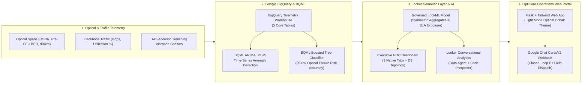

# 🌐 OptiCore Networks: Enterprise Fiber & Optical Network Intelligence Demo

An end-to-end **AI + BI Reference Architecture** showcasing autonomous telecom network operations, real-time optical telemetry monitoring, BigQuery ML anomaly detection (`ARIMA_PLUS` & Boosted Tree failure classification), Looker governed semantic modeling (LookML), Looker Conversational Analytics (Data Agents), and closed-loop Google Chat CardsV2 NOC alerting.

---

## 🏗️ System Architecture



---

## 📂 Repository Structure

```text
enterprise-fiber-network-demo/
├── README.md                                   # Architecture & 4-Step Deployment Guide
├── requirements.txt                            # Python dependencies
├── .env.example                                # Environment configuration template
├── server.py                                   # Flask backend (BigQuery ML, Gemini 3.8 Flash, Looker CA & Chat Actions)
├── static/
│   ├── index.html                              # Single-page Enterprise Web Portal (Tailwind CSS + Chart.js)
│   ├── favicon.svg                             # OptiCore Optical Cobalt Blue vector icon
│   ├── favicon.ico                             # Multi-resolution browser favicon
│   └── logo.png                                # 512x512 OpenGraph / Apple Touch icon
├── lookml/                                     # Complete LookML Semantic Layer & Dashboard
│   ├── telecom_network_analytics.model.lkml    # Core LookML Model & Explores
│   ├── manifest.lkml                           # LookML project manifest
│   ├── views/
│   │   ├── fiber_routes.view.lkml
│   │   ├── noc_incidents.view.lkml
│   │   ├── optical_span_anomalies.view.lkml
│   │   ├── predictive_maintenance_spans.view.lkml
│   │   └── route_traffic_anomalies.view.lkml
│   └── dashboards/
│       └── telecom_network_intelligence.dashboard.lookml
└── scripts/
    ├── setup_bigquery_telecom.py               # Automated BigQuery table & synthetic telemetry generator
    └── send_gchat_alert.py                     # Zero-dependency Google Chat CardsV2 NOC alert dispatcher
```

---

## 🚀 Step-by-Step Deployment Guide

### Step 1: Provision BigQuery Tables & Synthetic Telemetry
Authenticate with Google Cloud SDK (`gcloud auth application-default login`) and run the automated provisioning script to create the `demo_telecom_network_analytics` dataset and populate all 5 telemetry and anomaly tables:

```bash
pip install -r requirements.txt
python3 scripts/setup_bigquery_telecom.py \
  --project-id your-gcp-project-id \
  --dataset-id demo_telecom_network_analytics
```

### Step 2: Deploy LookML Project to Looker
1. In your Looker instance, create a new LookML project named `telecom_network_analytics` connected to your BigQuery database connection (`telecom_bigquery_conn`).
2. Copy the files from the [`lookml/`](lookml/) directory into your Looker project repository (or upload via Looker IDE / `looker-cli`).
3. Update the `sql_table_name` references in `lookml/views/*.view.lkml` if your dataset name differs from `demo_telecom_network_analytics`.
4. Validate LookML and deploy to production (`master` branch).

### Step 3: Configure Environment Variables
Copy `.env.example` to `.env` and configure your GCP project, Looker host, and optional Google Chat webhook URL:

```bash
cp .env.example .env
```

Edit `.env`:
```ini
GCP_PROJECT=your-gcp-project-id
BQ_DATASET=demo_telecom_network_analytics
GOOGLE_APPLICATION_CREDENTIALS=/path/to/your/service_account_key.json

LOOKER_HOST=your-instance.looker.app
LOOKER_MODEL=telecom_network_analytics
LOOKER_DASHBOARD_ID=169
LOOKER_CA_AGENT_ID=your-conversational-analytics-agent-id

# Optional: Google Chat Space Webhook URL for live P1 NOC alert dispatching
GCHAT_WEBHOOK_URL=https://chat.googleapis.com/v1/spaces/...
PORT=8089
```

### Step 4: Launch the Web Application
Start the Flask server:

```bash
python3 server.py
```

Open `http://localhost:8089` in your browser to explore:
- **Home (`#tab-home`)**: 5-stage AI + BI reference architecture walkthrough, governed semantic metrics overview, and multi-surface AI distribution matrix.
- **Live Telemetry & BQML Studio**: Interactive Chart.js optical attenuation and bandwidth anomaly time-series with 95% ARIMA_PLUS confidence bounds and AutoML feature importances.
- **Looker Conversational AI (`#tab-looker-ca`)**: Embedded Looker Data Agent interface for natural language root-cause analysis.
- **Executive NOC Dashboard**: Embedded Looker dashboard with D3 network topology and closed-loop P1 Google Chat field dispatch actions.
