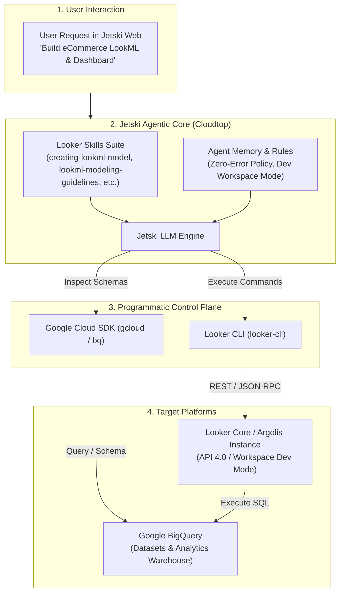

# Agentic LookML Engineering: Architecture, Programmatic Workflow & Colleague Setup Guide

This guide explains how **Jetski** (Google's agentic AI coding assistant) programmatically authors, validates, tests, and deploys **LookML** projects end-to-end, and provides a turnkey blueprint for any colleague or Customer Engineer (CE) to replicate this exact setup on their Cloudtop.

---

## 📑 Table of Contents
1. [Executive Overview: Why LookML Over Raw SQL?](#1-executive-overview-why-lookml-over-raw-sql)
2. [High-Level System Architecture](#2-high-level-system-architecture)
3. [Under the Hood: The 9-Step Programmatic LookML Pipeline](#3-under-the-hood-the-9-step-programmatic-lookml-pipeline)
4. [Turnkey Setup Guide for Colleagues](#4-turnkey-setup-guide-for-colleagues)
   - [Step 1: Cloudtop & Tooling Prerequisites](#step-1-cloudtop--tooling-prerequisites)
   - [Step 2: GCP & BigQuery Authentication](#step-2-gcp--bigquery-authentication)
   - [Step 3: Looker CLI (`looker-cli`) Installation & OAuth](#step-3-looker-cli-looker-cli-installation--oauth)
   - [Step 4: Installing the Looker Agentic Skills Suite](#step-4-installing-the-looker-agentic-skills-suite)
   - [Step 5: Agent Memory & Zero-Error Governance Rules](#step-5-agent-memory--zero-error-governance-rules)
5. [Critical Operational Gotchas & Solutions](#5-critical-operational-gotchas--solutions)
6. [Verification: Run Your First Agentic LookML Prompt](#6-verification-run-your-first-agentic-lookml-prompt)

---

## 1. Executive Overview: Why LookML Over Raw SQL?

Most generative AI demos rely on **raw Text-to-SQL**. While impressive for simple single-table questions, raw LLM-to-SQL fails in enterprise production environments:
- **Hallucinated Joins & Metric Drift**: Different prompts produce conflicting SQL definitions for core business metrics (e.g., *Net Revenue*, *Active Customers*, *Churn Rate*).
- **Fanout & Aggregation Traps**: Multiplying row counts across one-to-many joins leads to severe over-counting of financial measures unless symmetric aggregates are used.
- **Fragile & Ephemeral**: Raw SQL scripts live in transient chat transcripts without central version control, testing, or security governance.

### The Agentic LookML Alternative
Instead of generating raw un-governed SQL, **Jetski acts as an autonomous LookML software engineer**:
1. It introspects underlying data schemas in BigQuery.
2. It writes structured, object-oriented **LookML view and model files** (`.view.lkml`, `.model.lkml`).
3. It switches the Looker user session into **Developer Mode** (`dev` workspace).
4. It syncs the files directly to the Looker instance using the **Looker CLI (`looker-cli`)** and Looker API 4.0.
5. It runs Looker's internal **LookML compiler** (`validate_project`) and **self-heals** any syntax or join errors until zero errors remain.
6. It runs **live inline query tests** against Google BigQuery to guarantee runtime validity.
7. It compiles and imports User-Defined Dashboards (**UDDs**) and hands back a live, interactive Looker URL.

---

## 2. High-Level System Architecture



---

## 3. Under the Hood: The 9-Step Programmatic LookML Pipeline

When you ask Jetski to build or modify a LookML project, it executes the following technical sequence:

### Step 1: Schema Introspection & Discovery
Jetski queries BigQuery schemas or Looker connection metadata to understand the tables, column types, and relationships:
```bash
# Query BigQuery column schema
bq show --schema --format=prettyjson {project_id}:{dataset_id}.{table_name}

# Or introspect via Looker CLI metadata API
looker-cli api metadata connection_columns {connection_name} --schema_name {dataset} --table_names {table}
```

### Step 2: LookML View Generation (`.view.lkml`)
Jetski generates clean, standardized LookML view files locally in `/tmp` or scratch:
- **Primary Key**: Mandatory first dimension with `primary_key: yes` (critical for Looker symmetric aggregates).
- **Dimension Groups**: Standardized timeframes (`[raw, time, date, week, month, quarter, year]`).
- **Measures**: Strongly typed aggregations (`count`, `sum`, `average`) with `value_format_name: "usd"` and drill fields.

```lookml
view: orders {
  sql_table_name: `my-gcp-project.ecommerce.orders` ;;

  dimension: order_id {
    primary_key: yes
    type: string
    sql: ${TABLE}.order_id ;;
  }

  dimension_group: created {
    type: time
    timeframes: [raw, time, date, week, month, quarter, year]
    sql: ${TABLE}.created_at ;;
  }

  dimension: status {
    type: string
    sql: ${TABLE}.status ;;
  }

  measure: count {
    type: count
    drill_fields: [order_id, status, created_date]
  }

  measure: total_sale_price {
    type: sum
    sql: ${TABLE}.sale_price ;;
    value_format_name: usd
  }
}
```

### Step 3: LookML Model & Explore Generation (`.model.lkml`)
Jetski constructs the model file defining the database connection, file includes, and explores with explicit join relationships:
- **Explicit Joins**: Always includes `type: left_outer` (or `inner`) and explicit `relationship: many_to_one` / `one_to_many`.
- **Targeted Includes**: Avoids broad wildcards (`/views/*.view.lkml`) to optimize compiler performance.

```lookml
connection: "bigquery_conn"

include: "/views/orders.view.lkml"
include: "/views/users.view.lkml"
include: "/dashboards/**/*.dashboard.lookml"

explore: orders {
  label: "Orders & Customers"

  join: users {
    type: left_outer
    relationship: many_to_one
    sql_on: ${orders.user_id} = ${users.id} ;;
  }
}
```

### Step 4: Workspace Toggle to Developer Mode
> [!IMPORTANT]
> Looker API rejects direct file writes if the session is in `production` mode (returning HTTP 400 `Developer mode required`).
Jetski programmatically ensures the session is in `dev` workspace mode:
```bash
echo '{"workspace_id":"dev"}' | looker-cli api session update_session -
```

### Step 5: Remote File Creation & Synchronization via CLI
Jetski pushes the generated files directly into the Looker project:
```bash
# Create directory structure if needed
looker-cli project directory create {project_id} views

# Create or update view and model files
looker-cli project file create {project_id} views/orders.view.lkml /tmp/orders.view.lkml
looker-cli project file create {project_id} {model_name}.model.lkml /tmp/{model_name}.model.lkml
```

### Step 6: Model-to-Connection Registration
A LookML model cannot query a database until Looker explicitly authorizes the connection mapping. Jetski registers this configuration:
```bash
cat << 'EOF' > /tmp/model_config.json
{
  "name": "my_model",
  "project_name": "my_project",
  "allowed_db_connection_names": ["bigquery_conn"]
}
EOF

looker-cli model import /tmp/model_config.json
```

### Step 7: Zero-Error Compiler Validation & Self-Healing Loop
Jetski triggers Looker's internal LookML compiler API:
```bash
looker-cli api project validate_project {project_id}
```
**The Self-Healing Loop**:
- If the compiler returns errors, Jetski intercepts the error payload (identifying file, line number, and error type such as `unknown field`, `missing join`, or `syntax error`).
- Jetski automatically updates the file locally, uploads the patch via `looker-cli project file update`, and re-validates.
- **Under Jetski's Zero-Error Policy, no code is considered complete until Looker reports 0 compiler errors.**

### Step 8: Inline SQL Query Runtime Verification
Even if LookML compiles cleanly, database dialect errors can occur at runtime. Jetski verifies that Looker produces valid BigQuery SQL by running a real inline test query:
```bash
cat << 'EOF' > /tmp/verify_query.json
{
  "model": "my_model",
  "view": "orders",
  "fields": ["orders.status", "orders.total_sale_price"],
  "limit": 5
}
EOF

looker-cli query runquery --file /tmp/verify_query.json --format json
```
If the query returns valid data rows, semantic layer execution is verified.

### Step 9: LookML Dashboard Creation & UDD Sync
Jetski writes a native `.dashboard.lookml` file (specifying tiles, plot types, series colors, and layout), uploads it to `/dashboards/`, and imports it into a User-Defined Dashboard (UDD):
```bash
looker-cli dashboard import {model_name}::{dashboard_name}
```
The CLI returns a direct URL (e.g., `https://your-instance.looker.com/dashboards/123`), which Jetski presents directly to the user.

---

## 4. Turnkey Setup Guide for Colleagues

To replicate this exact autonomous LookML workflow on your own Cloudtop, follow these 5 setup steps.

### Step 1: Cloudtop & Tooling Prerequisites
Ensure your Cloudtop has Python 3.10+, Git, and curl installed:
```bash
python3 --version
git --version
mkdir -p ~/.local/bin
export PATH=$PATH:~/.local/bin
```

### Step 2: GCP & BigQuery Authentication
Authenticate `gcloud` using your **Argolis / Demo GCP User Account** (NOT your corp `@google.com` account) so you have proper IAM permissions to query and create BigQuery datasets:
```bash
# 1. Login with Argolis account
gcloud auth login

# 2. Set Application Default Credentials for Python BigQuery SDK
gcloud auth application-default login

# 3. Set active project
gcloud config set project {your-argolis-project-id}

# 4. Verify BigQuery access
bq ls --project_id=$(gcloud config get-value project)
```

### Step 3: Looker CLI (`looker-cli`) Installation & OAuth
Install the official open-source Looker CLI binary and authenticate:

```bash
# 1. Download latest Linux amd64 binary
curl -L -o ~/.local/bin/looker-cli https://github.com/looker-open-source/looker-cli/releases/latest/download/looker-cli-linux-amd64
chmod +x ~/.local/bin/looker-cli

# 2. Configure default profile pointing to your Looker instance
looker-cli profile add default --host https://{your-looker-instance}.looker.app --port 443
looker-cli profile use default

# 3. Authenticate via OAuth PKCE Interactive Login
looker-cli session login --oauth
```
Follow the terminal instructions: copy the authorization URL, open it in your browser, log in to Looker, and authorize the CLI.

Verify authentication:
```bash
looker-cli me
```
You should see your Looker user object and ID returned in JSON.

---

### Step 4: Installing the Looker Agentic Skills Suite

Jetski uses modular **Skills** (declarative markdown runbooks with YAML frontmatter) located in `~/.gemini/config/skills/`. When Jetski encounters a LookML task, it dynamically loads the relevant skill.

#### Download & Installation Options

You can obtain the pre-packaged 22 Looker skills (`looker_skills_bundle.tar.gz`) through any of the following methods:

**Option A: Direct Google Drive Download**
- **Drive Link**: [Download looker_skills_bundle.tar.gz on Google Drive](https://drive.google.com/file/d/1tD4P2R70YZS0KPmIk9crryE-K9q9wcG6/view?usp=drivesdk&resourcekey=0-Cb3L5F-2JPCuvR84RDOu-A)
- Download the `.tar.gz` file and extract it into `~/.gemini/config/skills/`:
  ```bash
  mkdir -p ~/.gemini/config/skills
  tar -xzf ~/Downloads/looker_skills_bundle.tar.gz -C ~/.gemini/config/skills/
  ```

**Option B: Direct Cloudtop-to-Cloudtop Transfer (Colleague's Terminal)**
If you are on your Cloudtop workstation, copy it directly from Zach's machine or extract it in a single command:
```bash
mkdir -p ~/.gemini/config/skills
ssh aragosa@aragosa.c.googlers.com "cat /usr/local/google/home/aragosa/.gemini/jetski/scratch/looker-ce-demo-kit/scripts/looker_skills_bundle.tar.gz" | tar -xzf - -C ~/.gemini/config/skills/
```

**Option C: Local Laptop Download (via Terminal)**
To copy the bundle to your local workstation:
```bash
scp aragosa@aragosa.c.googlers.com:/usr/local/google/home/aragosa/.gemini/jetski/scratch/looker-ce-demo-kit/scripts/looker_skills_bundle.tar.gz ~/Downloads/
```


#### What's in the Skills Suite?
The suite provides 22 specialized capabilities:
| Skill Name | Role / Purpose |
| :--- | :--- |
| `looker-developer-onboarding` | Master orchestrator coordinating discovery, CLI, project, model, and dashboard setup. |
| `onboarding-preflight-check` | Pre-flight validation of gcloud, BigQuery, Looker connection, and disk access. |
| `exploring-data-for-looker` | Autonomous data profiling, column inspection, and KPI proposal. |
| `installing-looker-cli` | Checks and configures `looker-cli` binary in PATH. |
| `authenticating-looker-cli` | Manages OAuth login and profile configuration in `config.yaml`. |
| `connecting-looker-to-bigquery` | Verifies and provisions database connections in Looker. |
| `setting-up-looker-project` | Creates empty projects and initializes bare Git repositories. |
| `creating-lookml-model` | Writes views, models, registers connection bindings, and executes validation. |
| `creating-looker-dashboard` | Authors LookML dashboards, imports to UDDs, and iterates with user feedback. |
| `lookml-modeling-guidelines` | Strict style guide: primary keys, naming conventions, join types, and validation loops. |
| `lookml-view` & `lookml-model` | Deep syntax templates for views, derived tables, models, and explores. |
| `lookml-explore` & `lookml-fields` | Rules for joins, dimensions, measures, parameter filters, and drill paths. |
| `using-looker-cli` | CLI reference for schema metadata, query execution, and session management. |
| `looker-performance-optimizer`| Query diagnostics, PDT caching strategies, and performance tuning. |

---

### Step 5: Agent Memory & Zero-Error Governance Rules

Jetski maintains persistent memories in `/usr/local/google/home/{ldap}/memory/default/`. To ensure Jetski knows about Looker CLI peculiarities across all conversations, create this memory file:

Create `~/memory/default/looker_cli_workspace_dev_mode.md`:
```markdown
---
description: Looker CLI workspace management, developer mode toggles, session update commands, and user profile configuration.
---
# Looker CLI: Managing Workspaces and Developer Mode

## 1. Issue: "Developer Mode Required" Error
When running commands to write or modify project files using the CLI (such as `looker-cli project file create` or `looker-cli project file update`), you may encounter:
`Error: failed to write file (status 400 Bad Request): {"message":"Developer mode required"}`

## 2. Solution: Toggle Workspace to Dev Mode
Always switch session workspace to `dev` before creating or updating files:
```bash
echo '{"workspace_id":"dev"}' | looker-cli api session update_session -
```

## 3. Issue: Sudo / Impersonation (--su) Forbidden in Looker Core
Looker Core instances return:
`Error: failed to su to user 1: status=403 Forbidden. error={"message":"Unsupported in Looker (Google Cloud core)"}`
Never use `--su`. Configure OAuth tokens or user client credentials directly in `~/.config/looker-cli/config.yaml`.

## 4. Zero-Error Validation Policy
Always run `looker-cli api project validate_project {project_id}` after file changes and resolve all compiler errors before reporting completion.
```

---

## 5. Critical Operational Gotchas & Solutions

| Gotcha | Symptom / Error | Root Cause | Solution |
| :--- | :--- | :--- | :--- |
| **Production Mode Write Lock** | `400 Bad Request: Developer mode required` | The Looker API defaults to the `production` workspace where direct file modifications are prohibited. | Run `echo '{"workspace_id":"dev"}' \| looker-cli api session update_session -` before file commands. |
| **Looker Core Impersonation** | `403 Forbidden: Unsupported in Looker (Google Cloud core)` | Looker Google Cloud core instances disable the `login_user` (`--su`) endpoint for enterprise security. | Configure credentials directly for the target user under a named profile in `~/.config/looker-cli/config.yaml`. |
| **Model Connection Disallowed** | `Model not allowed on connection` during query | A new `.model.lkml` file was written, but the model name has not been authorized to query the connection. | Run `looker-cli model import /tmp/model_config.json` specifying `allowed_db_connection_names`. |
| **Symmetric Aggregates / Fanout** | Incorrect inflated sums when joining tables | The joined view does not declare `primary_key: yes` on a unique identifier column. | Always define `primary_key: yes` on the first dimension in every `.view.lkml`. |
| **Wildcard Include Bloat** | Project validation timeouts or circular compile errors | Using broad wildcards like `include: "/views/*.view.lkml"`. | Use targeted includes: `include: "/views/table_name.view.lkml"`. |

---

## 6. Verification: Run Your First Agentic LookML Prompt

Once you have completed Steps 1 through 5, test your setup by opening **Jetski Web** (`go/jetski`) and sending this end-to-end prompt:

```text
Please explore my BigQuery dataset in project 'my-argolis-project' dataset 'ecommerce_demo'.
Create a new Looker project named 'ecommerce_agentic_demo', build LookML views for orders and users with primary keys, define an explore joining them in a model file, configure the connection mapping to 'my_bigquery_conn', compile-validate the project, run a 5-row inline test query, and generate an executive Looker dashboard URL.
```

Jetski will:
1. Introspect your BigQuery tables.
2. Generate `.view.lkml` and `.model.lkml`.
3. Switch session to `dev` mode.
4. Upload files via `looker-cli`.
5. Register the model connection.
6. Validate with zero errors.
7. Execute an inline query verification.
8. Deliver a live, interactive Looker dashboard link.
